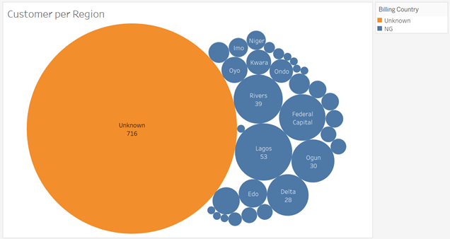

# Ecommerce-Analytics
Trying out Prediction, Classification and Clustering  on E- Commerce data

Author and Contribution list
----------------------------
Afolabi Ibukun

Obinna Okorie

Project Description
-------------------
In this project various e-commerce analytics techniques was used to solve the problem of customer retension. Techniques used included descriptive analytics, predictive analytics using MLR(Multiple Linear Regression) and ANN(Artificial Neural Network), classification analytics using classification tree and ANN(Artificial Neural Network) and clustering using K-Means algorithm.
The project aims to provide actionable recommendation to improve sales,increase the e-commerce business customer base and cut marketing cost which id traceable to return in investment. 

Data Description
----------------
The dataset used for this project was extracted from the Afrimash DEngage platform. They include:
1.	Master_contact 
(contact_key,contact_status,email,email_permission,email_status, email_status_reason,is_email_active,name,surname,gender,segment,source, subscription_date,created_at,created_by,updated_at,updated_by,contact_type, segment,email_subscriber, vendor,affiliate,shipping_city,shipping_state)
2.	Master_device             
(device_id,token,contact_key,device_type,device_brand,os,os_version,browser, last_activity_date,created_at,created_by,updated_by,wp_subscription)
3.	Orders
(contact_key,order_id,order_date,order_status,order_source,item_count, total_amount,discounted_price,payment_method,shipping,coupon_code)
4.	Order Event Details
(order_id,discounted_price,unit_price,quantity,product_id,product_variant_id,key,event_date)
5.	Order Event
(camp_id,coupon_code,event_date,key,session_id,total_amount,payment_method, item_count,event_type,shipping,order_id,discounted_price,send_id)
6.	Order details
(product_variant_id,order_prouct_status,order_id,discounted_price,unit_price, quantity,product_id,contact_key)

Descriptive Analytics
---------------------

Prediction
-----------

Classification
--------------

Clustering
----------

